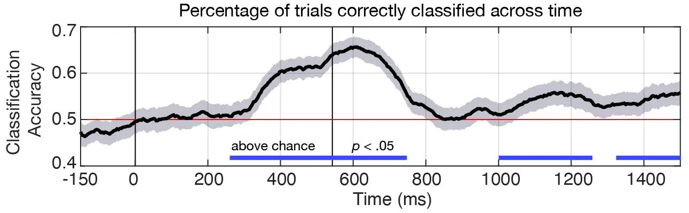

People are faced with noisy, ambiguous language every day whether it's through conversation, social media, reading, etc. How do people deal with these types of situations that all occur all the time? 

Using **electroencephalography** (EEG, for short), we can investigate what kind of brain patterns contribute to resolving difficulty in language. Here, I have collaborated with the University of Colorado and the University of Maryland to source and put together a neural data set that tackles this question.

For a more detailed description about the methods and design of the project, I will be giving a presentation on this project at the [**37th Annual Conference on Human Sentence Processing**](https://hsp2024.github.io/). Paper is in prep.

### Main Goals

To keep it simple for this post, I am using **average theta-band power** as a feature in this data set. We have reason to believe that brain frequency in the ~3 to 8Hz range can be used as a marker of resolving conflict in language. 

Here are some more facts about the dataset:
1. The input data is a 3D array, where there are 841 trials, 63 sensors or channels across the scalp, and 476 time samples (one every 4ms).

2. Each trial consists of neural activity that was recorded while the participant was reading a sentence (**input**), and their response to a follow-up question (**target label**). 

3. The target classes are imbalanced. I under-sample the majority class across multiple iterations to solve this problem.

The goals of this project (extension, really) is to determine the best classification method that successfully uses the neural activity **during the sentence** to predict how people respond to the **following** question.

### Initial Results

So, spoiler, I have already successfully classified this particular dataset using **support vector machines** in MATLAB.

From ~250 ms to 750 ms, performance accuracy reaches about 65%. This is particularly good for a classifier trained on EEG data! Especially considering the classification problem here is predicting a follow-up response, and is using a simple linear classifier.

**Note**: Shaded region represents 95% confidence intervals, and cluster-based permutation testing was used to evaluate difference from chance.

